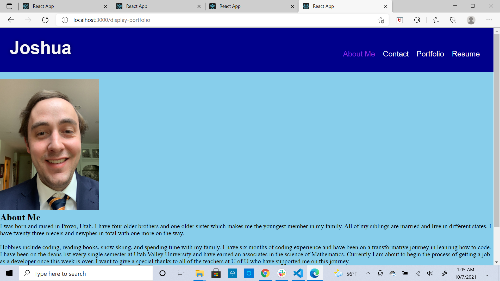

## Title:
React Portfolio

## Description:
This challenge was to create a portfolio using our skills with the react library. We had to make sure to use alternate pages or components to move around the different pages 
that make up the portfolio. The pages were all had details that will be used to helpl secure future jobs. 

## Table of Contents:
*[Tasks](#tasks)
*[Achievement](#achievement)
*[Future](#future)
*[Screenshot](#screenshot)
*[Link](#link)
*[Contributors](#contributors)

## Tasks:
1. When the application opened the page contained a header with a navigation bar, a footer, and a section where all of the content would go
2. The navigation bar has a link that connects to the different sections of the portfolio and the current section link is highlighted
3. When a person switches from one page to another the links stay highlighted
4. The about me page is the page that loads when the application first starts with the link highlighted
5. The about me section has a picture and contains a short bio on the person
6. The portfolio section has six pictures of applications we have craeted in the bootcamp and has links to the github repository, a link to the application website, and the image is titled
7. The contact section has a comment form for a person to add their name, email, and message they can write
8. Moving the mouse away from an input field causes the user to recieve an alert that the input field can not be empty
9. An invalid email causes a message to appear that the email is invalid
10. The resume has a link to a professional resume and the profiecies we have gianed in the bootcamp
11. The footer has links to three other platforms such as Github, LinkedIn and Twitter

## Achievement:
I was able to achieve the majority of the tasks besides one with the mouse moving away from the input filed. What helped me complete these tasks was from finding video tutorials on how to create a link between other pages and how to the links highlighted. Reviewing the module also helped me alot when I was first learning the terms associated with react.

## Future:
The future development of this application will be going over the styling. I still have two assingments to turn in before my extension ends on Sunday for the boootcamp. I would also like to attempt getting the icons on the portfolio.

## Screenshot:

## Link:
<a href="https://joker282855.github.io/display-portfolio/">Application Link</a>

## Contributors:
Made with Love By Josh Jackson